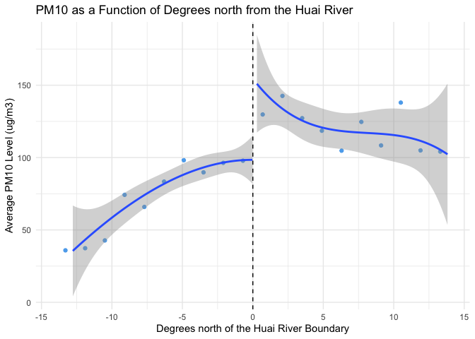
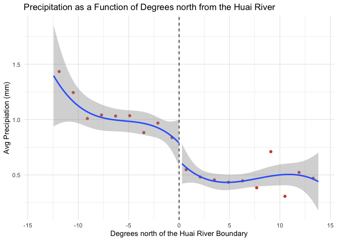
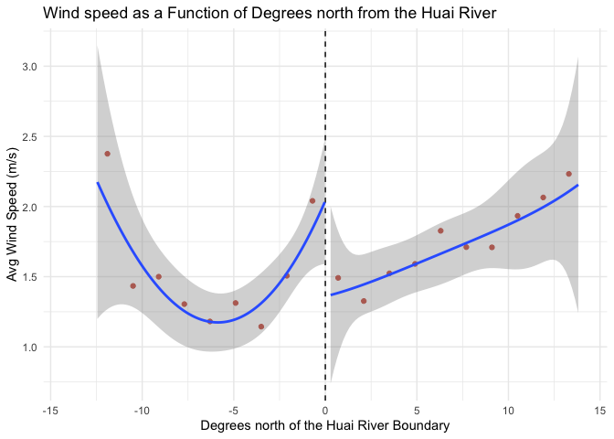
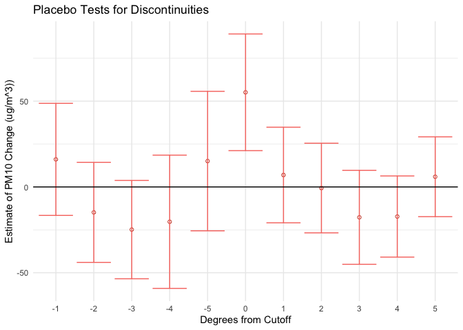

<!-- README.md is generated from README.Rmd. Please edit that file -->

# The Effect of the Huai River Policy on Pollution

<!-- badges: start -->
<!-- badges: end -->

  As part of a project for an Econometrics course in experimental
design, I replicate the regression discontinuity approach employed by
Ebenstein et al. in *New evidence on the impact of sustained exposure to
air pollution on life expectancy from China’s Huai River Policy*.
Ebenstein and his coauthors leverage China’s arbitrary Huai River policy
which designated areas north of the Huai River as recipients of free or
subsidized coal for indoor heating. The authors focus on estimating the
effects of the policy on pollution and life expectancy; I, however,
focus solely on the causal estimation of the effects on pollution as the
demographic data needed for the analysis of changes in life expectancy
is not public.

## Camparing the effects of the policy south and north of the Huai River:

  A simple comparison of northern cities with southern cities would not
be useful to examine causal effects because it does not allow us to
single out the effect of the Huai River Policy. Cities in the north of
China, say Beijing, can vary drastically from cities in the south, say
Shenzhen, whether it is economically, geographically, or
demographically. Consequently, changes measured in these regions after
the policy implementation cannot be attributed to the policy because the
numerous factors that differentiate the regions could also be behind the
changes. The regression discontinuity design implemented by Ebenstein et
al. addresses this problem by analyzing the changes in the regions right
on the border of the river (used as a demarcation line by the policy).
The assumption is that towns on both sides of the river will be
virtually the same, yet were subject to different costs to access
heating do to an arbitrary demarcation choice. Hence, the changes
measured post-policy should be attributable to the policy due to the
regions’ similarities.

## Overall approach:

  Globally, the approach is to narrow down the observations to a group
of towns/cities near the border of the Huai River and to estimate the
change in pollution levels associated with being north of our cutoff
(i.e., the river). For the measure of pollution I use the variable
*pm10* which represents the average level of PM10, a type of particulate
matter that adversely affects human health, found in the air. A priori,
PM10 levels are expected to increase with higher use of heating. The
assignment variable is *dist_huai*, which denotes the distance in
degrees north or south of the Huai river. The other independent
variable, *north_huai*, is a dummy variable which equals one if a town
is north of the river and zero otherwise.

## Plotting the data:

  A discussed earlier, changes in the levels of pollution in regions far
away from the cutoff for the policy are not necessarily relevant since
it is hard to isolate the effects of the policy. Instead, in a
regression discontinuity design, the interest is in the changes observed
at and near the cutoff. Specifically, what we intend to examine with a
graph is if we observe a discontinuity at the cutoff - in other words,
do we see a sudden jump in pollution levels just north of the river?

  We’ll use a binned scatter plot, where each bin represents the average
of pollution levels for towns at a certain degree from the cutoff. A
binned scatter plot is necessary here because it allows us to avoid any
overlap of observations that may obfuscate trends in the data, and the
bins facilitate dividing the data into degrees from the cutoff.

<!-- -->

## Balance tests:

  In essence, with balance tests we examine if characteristics across
groups (in this case climatic characteristics across regions) follow
similar trends (i.e., are they “balanced”). The goal is to gauge if the
treatment, in our case the being north of the Huai River, affects these
characteristics; if no significant changes seem to be present, then
these tests support any causal relationships found between treatment and
outcome.

  The carry out these tests, we can generate binned scatter plots of
each characteristic available in the data - temperature, precipitation,
and wind speed - as a function of location with respect to the Huai
River boundary. Running a regression of treatment on these
characteristics would give more precise results - statistically
significant coefficients indicate a characteristic is not balanced. But
since here we are dealing with climatic characteristics, rather than the
usual demographic characteristics in random samples, ensuring that the
general trend is found across the data suffices.

-   Temperature test:

<!-- -->

-   Precipitation test:

<!-- -->

-   Wind speed test:

<!-- -->

  In the case of temperature and precipitation, we find there are very
slight differences when crossing the cutoff, but most importantly we see
the same trend is present north and south of the river. The case of wind
speed is trickier, as we see a slight discontinuity at the river as well
as potentially different trends. An significant note in this case,
however, is that the change in trends that seems to be present at the
cutoff looks to be primarily driven by the wind speed average of towns 1
degree south of the cutoff, which could be an outlier.

## Setting a bandwidth:

  To analyse the effects of the Huai River policy, to narrow down the
group of observations used to towns near the cutoff as we need towns
that are subject to similar conditions. If we satisfy this condition,
then we strengthen the assumption that the Huai River policy is the main
driver of any changes in pollution levels. We will narrow down the group
of towns used by setting a five-degree bandwidth - in practice, this
translates to only examining changes in towns that are 5 degrees or less
away from the Huai river (i.e., our cutoff).

-   Bandwidth of 5 degrees:
    

## Estimating the discontinuity:

  The specification used will be the following:

      where we regress PM10 levels on the dummy for whether a town is
north of the river, *north_huai*, on the degrees from the river,
*dist_huai*, and on their interaction.

    Balance Tests
    =====================================================================================
                                             Dependent variable:                         
                     --------------------------------------------------------------------
                           PM10          Temperature     Precipitation      Wind Speed   
                            (1)              (2)              (3)              (4)       
    -------------------------------------------------------------------------------------
    Treatment            55.143***         -5.815*          -0.265**         -0.627*     
                     (21.701, 88.585)  (-11.998, 0.367) (-0.524, -0.006) (-1.247, -0.007)
                                                                                         
    Running Variable       1.266            0.518            -0.034          0.186***    
                      (-6.016, 8.548)  (-0.829, 1.865)  (-0.090, 0.022)   (0.051, 0.321) 
                                                                                         
    Interaction           -10.185           -1.474           0.001            -0.136     
                     (-22.614, 2.243)  (-3.748, 0.800)  (-0.094, 0.096)  (-0.364, 0.092) 
                                                                                         
    Constant             98.679***        61.338***         0.833***         1.961***    
                     (80.043, 117.316) (57.865, 64.812)  (0.687, 0.978)   (1.613, 2.310) 
                                                                                         
    -------------------------------------------------------------------------------------
    Observations            79                79               79               79       
    =====================================================================================
    Note:                                                     *p<0.1; **p<0.05; ***p<0.01

## Identification Assumption:

  In a regression discontinuity design, the identification assumption is
that the only reason for discrete jumps in the dependent variable around
the cutoff are changes in assignment to the cutoff. In other words,
observations on either side of the cutoff would have similar outcomes
absent of treatment. The identification assumption is violated when
individuals have precise control over which side of the cutoff they will
be on (i.e., they have control over the assignment variable).

  When graphing bin scatter plots of temperature, precipitation and wind
speed as a function of degrees north of the cutoff, we find that there
is a jump at the discontinuity but the trends remain constant for the
most part. In the case of temperature the jump at the cutoff is small
and the (mostly) linear trend is constant - I say mostly because south
of a cutoff we see a quadratic trend but this is driven primarily by the
bin for the observations closest to the cutoff, so we can assume some
noise here. The jump for precipitation is also rather small and the
cubic trend in the data is constant. The case of wind speed is more
challenging to evaluate graphically as the data looks more spurious than
in the earlier cases; south of the cutoff we see a quadratic trend in
the data and north of the cutoff we see what could be a cubic trend but
with very slight variation. Moreover, the jump, or rather drop, at the
discontinuity for wind speed is more pronounced. The tests done with
regressions, however, do not find any significant effects associated
with treatment on temperature, precipitation and wind speed. These tests
show that absent of treatment, similar trends would be followed;
therefore the tests indicate that the identification assumption was not
violated.

## Is the issue of manipulation relevant in this case?

  Manipulation is relevant in studies in which individuals, who are part
of the study and whose outcomes are measured, may have control over
assignment of treatment (i.e., placement before or after cutoff). If
that were the case, then the regression discontinuity design would fail
since it would violate the key assumption that individuals on both sides
of the cutoff would have similar outcomes. In the case of the Huai river
policy study, the assignment of treatment (subsidized heating) is
completely arbitrary as it is based on a geographical feature (the
river). Additionally, the outcomes we are concerned with here are not
those of individuals who could change their location based on the
cutoff, but rather pollution levels which are directly dependent on
geographical location. Therefore, manipulation is not an issue.

#### What if we were measureing indivuals’ outcomes?

  If as part of the study we were to actually measure outcomes of
individuals, for example life expectancy, then we would have to run a
manipulation test to ensure individuals did not have control over
assignment north of the cutoff to access the subsidized heating. To do
so, plotting the distribution of individuals’ locations with respect to
the cutoff. The proper distributions that would pass the manipulation
test would vary as they are highly contextual. In our case, the
distribution would not be normal but rather it would depend on the
geographical location of cities. They key would be to examine if there
is a concentration of individuals right north of the Huai river,
indicating whether individuals moved specifically top secure the
subsidized heating. Unfortunately, we cannot run this test because, as
previously mentioned, the demographic data is not public.

## Placebo test:

#### Why is a placebo test necessary?

  A discontinuity at the cutoff boundary, is indicative of a potential
effect stemming from the Huai River policy. However, if we find that
discontinuities are present in other parts of the data, then the
conclusions of the main cutoff are undermined. A placebo test can be
used to examine these possibilities; specifically in our case, the
placebo test examines whether discontinuities are found in other regions
China as a result of the Huai River policy.

#### Running the placebo test:

  The placebo test can be ran by plotting the estimated discontinuities
in pollution levels of PM10 at one degree latitude intervals north and
south. Th essence of the test is to

<!-- -->

  The only significant coefficient estimate of a discontinuity is that
of the actual cutoff (the Huai river), with an estimate slightly above
50 without a possible effect of zero within the confidence intervals.
Thus, the results show that no other region has statistically
significant discontinuous changes in PM10.

## Source

[Ebenstein, A., M. Fan, M. Greenstone, G. He, and M. Zhou. 2017. New
evidence on the impact of sustained exposure to air pollution on life
expectancy from China’s Huai River Policy. Proceedings of the National
Academy of Sciences of the USA 114 (39):
10384–89](https://www.pnas.org/doi/abs/10.1073/pnas.1616784114)
